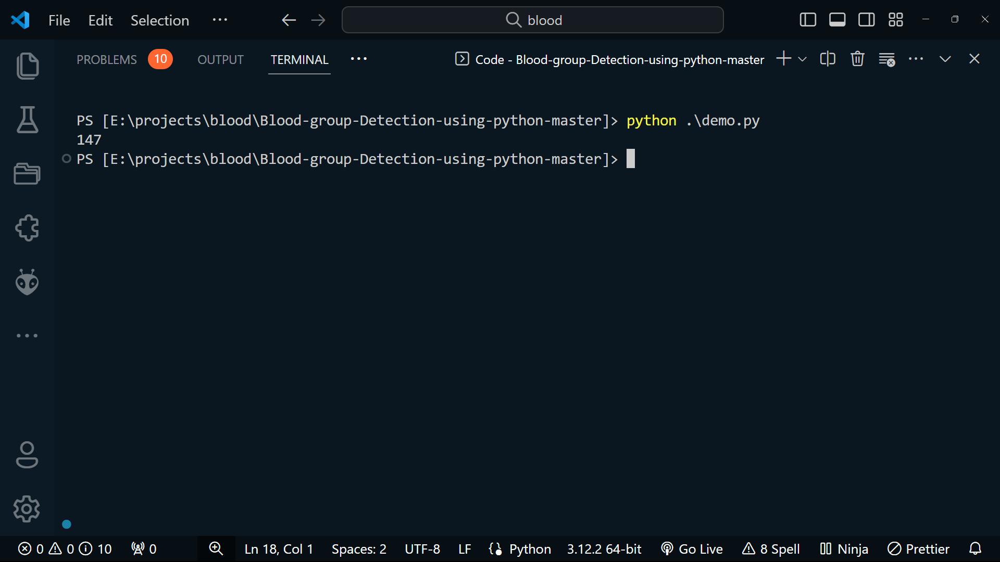
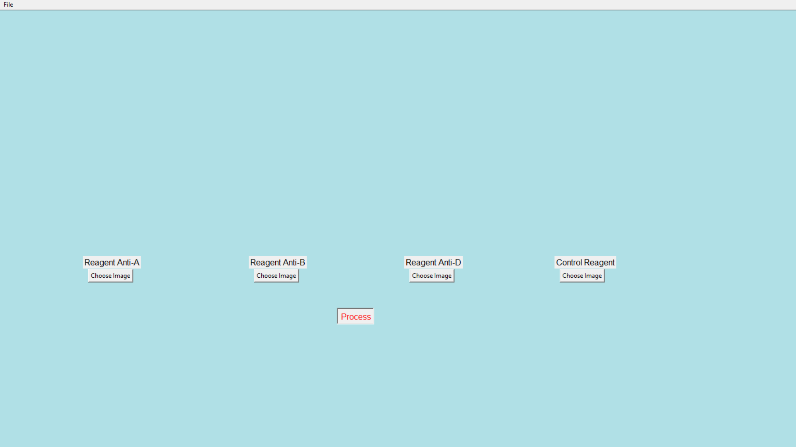
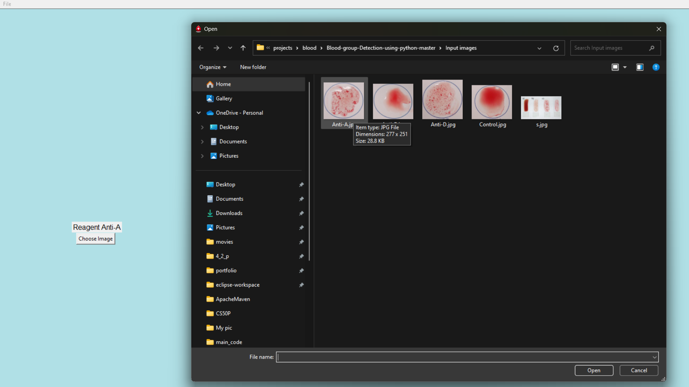
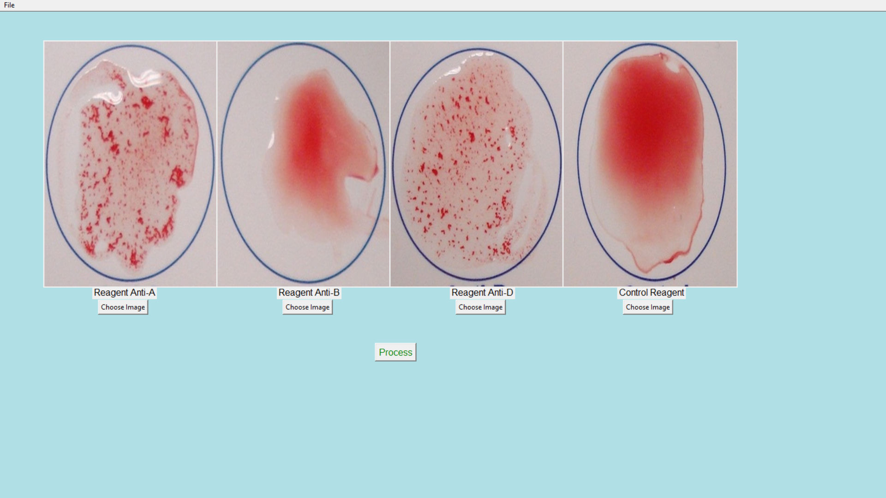
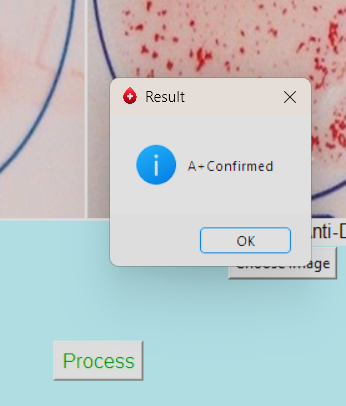

# Debug :Blood group Detection using python python

## Author

- Name : Anirudh
- GitHub : https://github.com/anirudhjaishankar

## Debugging By :

- Name: [Mahesh Babu Sammeta](https://github.com/sammetamaheshbabu)
- GitHut : https://github.com/sammetamaheshbabu
- LinkedIn : https://www.linkedin.com/in/sammetamaheshbabu/
- I'm from Hyderabad, India.
- Date : 06-03-2024

## Table of Contents

1. [Introduction](#introduction)
2. [Objective](#objective)
3. [Features](#features)
4. [Project Overview](#project-overview)
5. [Working of the Project](#working-of-the-project)
6. [Libraries Used](#libraries-used)
7. [Installation and Usage](#installation-and-usage)
8. [Results](#results)
9. [Final Outcome](#final-outcome)
10. [Advantages](#advantages)
11. [Conclusion](#conclusion)
12. [Note](#note)
13. [Contact](#contact)

---

## DEMO Video link:

- ### [YouTube](https://youtu.be/UeWgFXQND7E).

## Introduction

Blood Group Detection System is a Python application designed to determine the blood group of a person based on images of blood samples reacted with different reagents. The system utilizes image processing techniques to analyze the reactions and infer the blood group accurately.

## Objective

The main objective of the Blood Group Detection System is to automate the process of blood group determination, reducing manual errors and time consumption in traditional methods.

## Features

1. **Image selection**: Allows users to choose images of blood samples for analysis.
2. **Green plane extraction**: Extracts the green plane from the selected images to enhance antigen visibility.
3. **Thresholding techniques**: Utilizes various thresholding methods to segment the antigens from the background.
4. **Morphological operations**: Performs morphological operations to refine the antigen segmentation results.
5. **Histogram analysis**: Analyzes the pixel intensity distribution to further refine the blood group classification.
6. **Quantification**: Provides quantitative analysis of the blood sample to determine the blood group.

## Project Overview

The project utilizes image processing techniques to analyze blood sample images and determine the blood group based on the reactions with different reagents. It consists of various processes such as green plane extraction, thresholding, adaptive thresholding, morphology, histogram analysis, and quantification.

## Working Of The Project

1. Users select images of blood samples using the GUI interface.
2. The system applies various image processing techniques to enhance and segment the antigens from the background.
3. The segmented antigens are analyzed to determine the blood group based on their presence or absence.
4. The results are displayed to the user through the GUI interface.

## Libraries Used

The project utilizes the following Python libraries:

- `tkinter`: For building the graphical user interface.
- `OpenCV`: For image processing and analysis.
- `numpy`: For numerical operations on arrays.
- `matplotlib`: For generating histograms and visualization.
- `Pillow` :Image processing library

## Installation And Usage

### Installation

1. Clone the repository:

```bash
$ https://github.com/sammetamaheshbabu/Debug-Blood-group-Detection-using-python-python.git
```

2. Navigate to the project directory:

```bash
$ cd  Debug-Blood-group-Detection-using-python-python
```

3. To install the required dependencies, use the following command:

```bash
pip install -r requirements.txt
```

### Usage

1. Run the `demo.py` using Python:

```bash
python demo.py
```

2. If the demo file run successfully. Run the `GUI.py` file .

```bash
python GUI.py
```

3.  Follow the on-screen instructions to select and analyze blood sample images.

## Results

- Demo Results
  

- GUI window
  

- Input Images
  
  
  -Results prompt
  

The Blood Group Detection System provides accurate blood group analysis results based on the processed images of blood samples. The detected blood group is displayed to the user along with any relevant information or alerts.

## Final Outcome

The final outcome of the project is a user-friendly application that automates the process of blood group analysis, saving time and effort in laboratory settings. It provides reliable results and facilitates efficient blood sample management.

## Advantages

- Automates blood group analysis, reducing manual effort.
- Provides accurate and reliable results.
- User-friendly interface for easy interaction.
- Helps streamline laboratory workflows and improve efficiency.

## Conclusion

The Blood Group Detection System demonstrates the potential of computer vision and image processing techniques in healthcare applications. It offers a practical solution for blood group analysis, contributing to enhanced patient care and laboratory efficiency.

## Note :

This project is intended for educational and research purposes only. It should not be used as a substitute for professional medical diagnosis or blood typing procedures.

## Contact

For any inquiries or support, please contact [Linkedin](https://www.linkedin.com/in/sammetamaheshbabu/) ,[Instagram](https://www.instagram.com/sammetamaheshbabu/).

---
